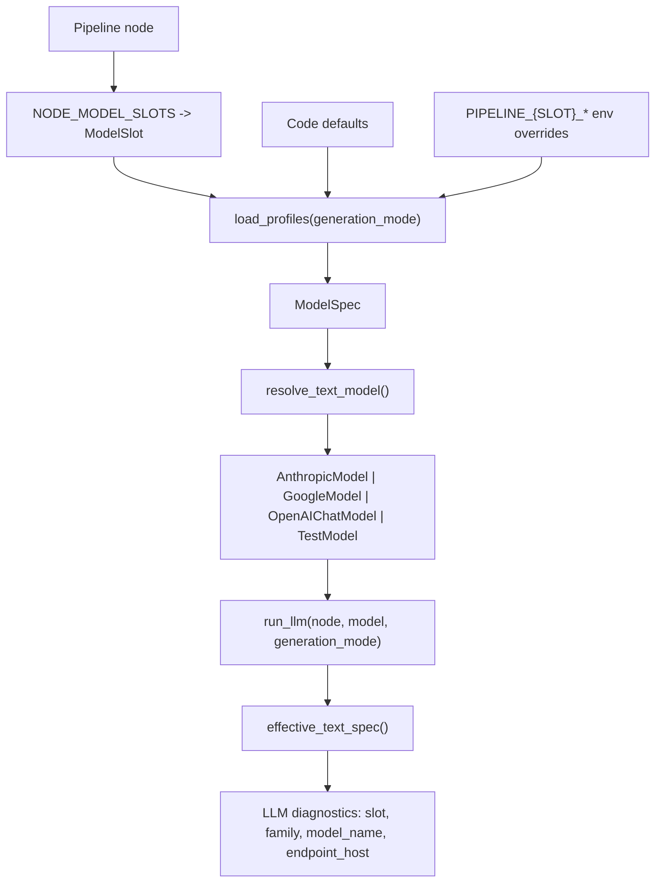

# Model Slots and Providers

**Status:** current implementation of the pipeline text-model routing layer.  
**Code:** [registry.py](../../backend/src/pipeline/providers/registry.py), [llm_runner.py](../../backend/src/pipeline/llm_runner.py), [events.py](../../backend/src/pipeline/events.py), [swap_model.py](../../backend/src/pipeline/cli/swap_model.py)

This document is the source of truth for how the pipeline chooses text models,
how slot overrides work, and what runtime diagnostics report.

## Goals

1. Nodes declare intent through a slot, not a vendor-specific model id.
2. Code defaults stay versioned and testable.
3. Env overrides can swap a slot to another transport family without code edits.
4. OpenAI-compatible providers share one transport path.

## End-to-End Flow



## Core Types

| Type | Purpose |
| --- | --- |
| `ModelSlot` | Coarse routing bucket: `FAST`, `STANDARD`, `CREATIVE` |
| `ModelFamily` | Transport family: `anthropic`, `google`, `openai_compatible`, `test` |
| `ModelSpec` | Resolved slot config: `family`, `model_name`, optional `base_url`, optional `api_key_env` |

## Node to Slot Mapping

| Node | Slot |
| --- | --- |
| `curriculum_planner` | `FAST` |
| `content_generator` | `STANDARD` |
| `diagram_generator` | `FAST` |
| `qc_agent` | `FAST` |

If another node starts making LLM calls, add it to `NODE_MODEL_SLOTS`.

## Mode Profiles and Overrides

`load_profiles(generation_mode)` works in two steps:

1. Start from `_DEFAULT_PROFILES_BY_MODE`, which defines one `ModelSpec` per slot for each `GenerationMode`.
2. Apply sparse slot overrides from env. Any provided field replaces the code default for that slot.

Supported env vars are:

| Variable | Purpose |
| --- | --- |
| `PIPELINE_{SLOT}_PROVIDER` | Transport family |
| `PIPELINE_{SLOT}_MODEL_NAME` | Model id for that family |
| `PIPELINE_{SLOT}_BASE_URL` | Optional custom endpoint, mainly for OpenAI-compatible hosts |
| `PIPELINE_{SLOT}_API_KEY_ENV` | Env var name that holds the API key |

`{SLOT}` uses enum names: `FAST`, `STANDARD`, `CREATIVE`.

Example:

```bash
export PIPELINE_FAST_PROVIDER=openai_compatible
export PIPELINE_FAST_MODEL_NAME=llama3-8b-8192
export PIPELINE_FAST_BASE_URL=https://api.groq.com/openai/v1
export PIPELINE_FAST_API_KEY_ENV=GROQ_API_KEY
export GROQ_API_KEY=sk-...
```

There are no legacy `MODEL_TEXT_*` or `PIPELINE_*_NAME` aliases anymore.

## Transport Families

| Family | Concrete model |
| --- | --- |
| `anthropic` | `AnthropicModel` |
| `google` | `GoogleModel` |
| `openai_compatible` | `OpenAIChatModel` with `OpenAIProvider` |
| `test` | `TestModel` |

`openai_compatible` is the catch-all transport for any endpoint that speaks the
OpenAI chat API shape. The `base_url` and `api_key_env` tell the provider which
host to use and which secret to read.

## Public Registry Helpers

| Function | Purpose |
| --- | --- |
| `get_node_text_slot(node_name)` | Return the slot for an LLM-backed node |
| `load_profiles(generation_mode)` | Return the merged slot-to-spec map |
| `get_node_text_model(node_name, model_overrides=..., generation_mode=...)` | Build the concrete PydanticAI model |
| `get_node_text_spec(node_name, generation_mode=...)` | Return the merged `ModelSpec` for that node |
| `resolve_text_model(slot=..., spec=..., model_overrides=...)` | Low-level builder, mainly for tests |
| `describe_text_model(model)` | Best-effort runtime description for tracing and cost |
| `effective_text_spec(catalog_spec=..., model=...)` | Prefer runtime identity over catalog defaults when known |
| `endpoint_host(base_url)` | Extract the endpoint host for diagnostics and pricing |

`model_overrides` is an internal test hook keyed by `ModelSlot` or slot string.

## `run_llm` and Diagnostics

`run_llm(...)` resolves `slot` and the catalog `ModelSpec` from the node name,
then uses `effective_text_spec(...)` so diagnostics reflect the same concrete
model object passed to `Agent(model=...)`.

`LLMCall*` events expose:

- `slot`
- `family`
- `model_name`
- `endpoint_host` for OpenAI-compatible endpoints

Retries are limited to transient failures. Empty or whitespace-only
`generation_id` skips `event_bus.publish`.

## Cost Estimation

Pricing is exact-match only:

- default key: `{family}:{model_name}`
- OpenAI-compatible key with custom endpoint: `{family}:{endpoint_host}:{model_name}`

If there is no pricing row, `cost_usd` stays `null`. The pipeline does not guess.

## CLI Helper

Use the CLI helper to update one slot override in the backend `.env` file:

```bash
python -m pipeline.cli.swap_model \
  --slot fast \
  --provider openai_compatible \
  --model llama3-8b-8192 \
  --base-url https://api.groq.com/openai/v1 \
  --api-key-env GROQ_API_KEY
```

The CLI only supports `--slot`.
